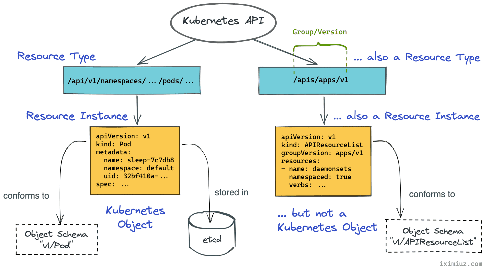
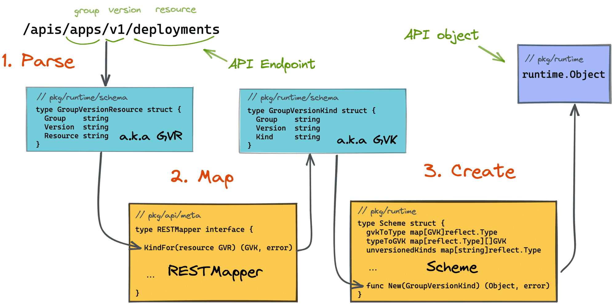

##

## methods

1️⃣ curl  
2️⃣ kubectl proxy  
3️⃣ Calling Kubernetes API using kubectl raw mode  
4️⃣ kubectl scale deployment sleep --replicas=2 -v 6

## 1️⃣ using curl to access api server

<details><summary>examples</summary>

Extract API Server Endpoint

```
export KUBE_API=$(kubectl config view --raw -o jsonpath='{.clusters[0].cluster.server}')
```

Extract and Decode the Client Certificate / Client Key / CA Certificate

```
kubectl config view --raw -o jsonpath='{.users[0].user.client-certificate-data}' | base64 -d > ~/client.crt
kubectl config view --raw -o jsonpath='{.users[0].user.client-key-data}' | base64 -d > ~/client.key
kubectl config view --raw -o jsonpath='{.clusters[0].cluster.certificate-authority-data}' | base64 -d > ~/ca.crt
```

Use curl to Call the Kubernetes API

```
curl --cert ~/client.crt --key ~/client.key --cacert ~/ca.crt ${KUBE_API}/api
```

### create a deployment

HTTP POST

```
curl ${KUBE_API}/apis/apps/v1/namespaces/default/deployments \
  --cert ~/client.crt \
  --key ~/client.key \
  --cacert ~/ca.crt \
  -X POST \
  -H 'Content-Type: application/yaml' \
  -d '---
apiVersion: apps/v1
kind: Deployment
metadata:
  name: sleep
spec:
  replicas: 1
  selector:
    matchLabels:
      app: sleep
  template:
    metadata:
      labels:
        app: sleep
    spec:
      containers:
      - name: sleep
        image: curlimages/curl
        command: ["/bin/sleep", "365d"]
'

```

### get all objects in the default namespace

```
curl $KUBE_API/apis/apps/v1/namespaces/default/deployments \
  --cert ~/client.crt \
  --key ~/client.key \
  --cacert ~/ca.crt
```

### get an object by a name and a namespace

```
curl $KUBE_API/apis/apps/v1/namespaces/default/deployments/sleep \
  --cert ~/client.crt \
  --key ~/client.key \
  --cacert ~/ca.crt
```

### watch

```
curl ${KUBE_API}/apis/apps/v1/namespaces/default/deployments?watch=true \
  --cert ~/client.crt \
  --key ~/client.key \
  --cacert ~/ca.crt

```

</details>

## 2️⃣ using kubectl proxy to access api server

<details><summary>examples</summary>

```
kubectl proxy --port=8080 &

curl localhost:8080/apis/apps/v1/deployments
```

</details>

## 3️⃣ using kubectl --raw to access api server

<details><summary>examples</summary>

when the --raw flag is used, the implementation boils down to converting the only argument into an API endpoint URL and invoking the raw REST API client.

```
# Sends HTTP GET request
$ kubectl get --raw /api/v1/namespaces/default/pods

# Sends HTTP POST request
$ kubectl create --raw /api/v1/namespaces/default/pods -f file.yaml

# Sends HTTP PUT request
$ kubectl replace --raw /api/v1/namespaces/default/pods/mypod -f file.json

# Sends HTTP DELETE request
$ kubectl delete --raw /api/v1/namespaces/default/pods
```

</details>

## Diagrams

<p align="center">
  
</p>

---

<p align="center">
  
</p>

---

<p align="center">
  
</p>

---

<p align="center">
  
</p>

## Reference

[How To Call Kubernetes API using Simple HTTP Client](https://iximiuz.com/en/posts/kubernetes-api-call-simple-http-client/)
[Kubernetes API Basics - Resources, Kinds, and Objects](https://iximiuz.com/en/posts/kubernetes-api-structure-and-terminology/)
[How To Call Kubernetes API from Go - Types and Common Machinery](https://iximiuz.com/en/posts/kubernetes-api-go-types-and-common-machinery/)
