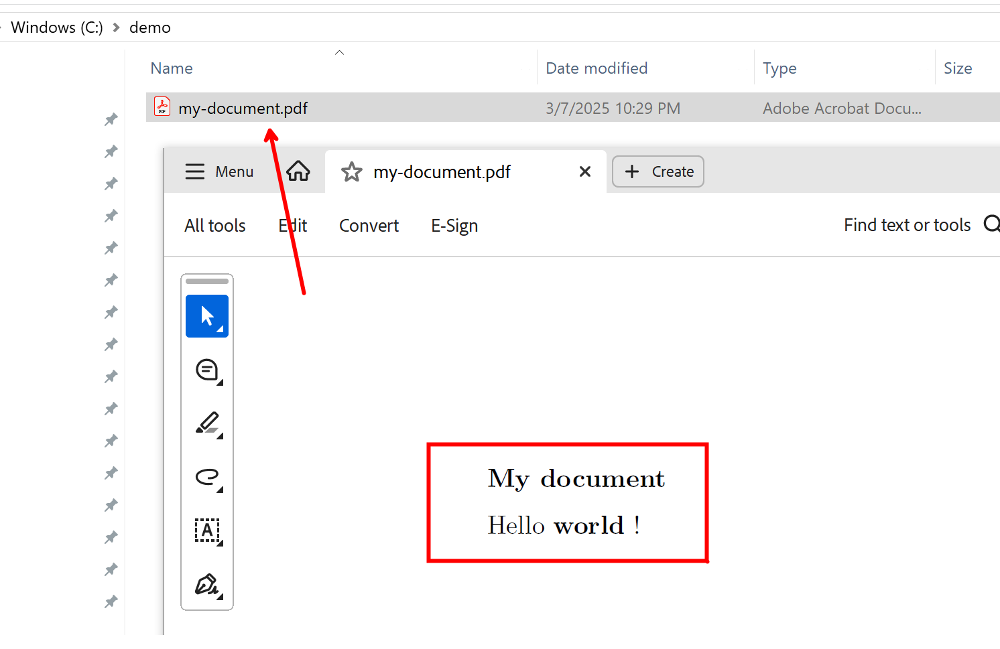
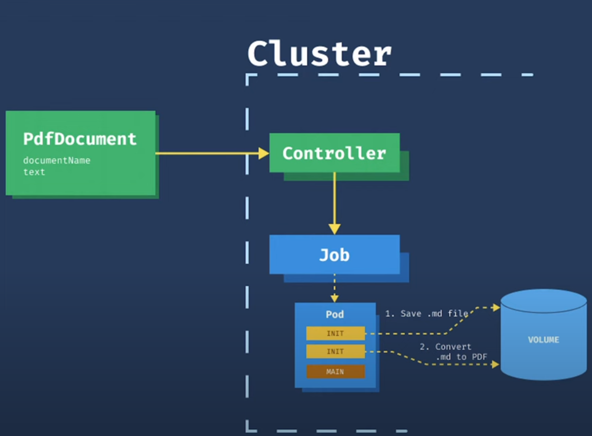

## (Hello World) markdown to pdf controller

Extend the Kubernetes API server functionality by implementing a custom controller that allows users to submit a Markdown file and generate a corresponding PDF. Users can submit the task via kubectl by creating a custom resource.

### 1️⃣ Create project using Kubebuilder

<details><summary>...</summary>

```
mkdir -p ~/projects/pdfdocument
cd ~/projects/pdfdocument

kubebuilder init --domain example.com --repo example.com/pdfdocument
kubebuilder create api --group tools --version v1 --kind PdfDocument
```

</details>

### 2️⃣ Code

<details><summary>...</summary>

🅰️ modify the data structure (schema)

`// api/v1/pdfdocument_types.go`

```
        DocumentName string `json:"documentName,omitempty"`
        Text         string `json:"text,omitempty"`
```

`// internal/controller/pdfdocument_controller.go`

```
import (
	"context"
	"encoding/base64"
	"fmt"

	batchv1 "k8s.io/api/batch/v1"
	corev1 "k8s.io/api/core/v1"                   // For PodTemplateSpec and PodSpec
	metav1 "k8s.io/apimachinery/pkg/apis/meta/v1" // For ObjectMeta
	"k8s.io/apimachinery/pkg/runtime"
	ctrl "sigs.k8s.io/controller-runtime"
	"sigs.k8s.io/controller-runtime/pkg/client"
	"sigs.k8s.io/controller-runtime/pkg/log"

	// toolsv1 "example.com/pdfdocument/api/v1"
)
```

🅱️ Reconcile

```
func (r *PdfDocumentReconciler) Reconcile(ctx context.Context, req ctrl.Request) (ctrl.Result, error) {
	log := log.FromContext(ctx)

	var pdfDoc toolsv1.PdfDocument
	if err := r.Get(ctx, req.NamespacedName, &pdfDoc); err != nil {
		log.Error(err, "unable to fetch PdfDocument")
		return ctrl.Result{}, client.IgnoreNotFound(err)
	}

	jobspec, err := r.createJob(pdfDoc)
	if err != nil {
		log.Error(err, "unable to create Job")
		return ctrl.Result{}, client.IgnoreNotFound(err)
	}

	if err := r.Create(ctx, &jobspec); err != nil {
		log.Error(err, "unable to create Job")
	}

	return ctrl.Result{}, nil
}
```

```
func (r *PdfDocumentReconciler) createJob(pdfDoc toolsv1.PdfDocument) (batchv1.Job, error) {
	image := "knsit/pandoc"
	base64text := base64.StdEncoding.EncodeToString([]byte(pdfDoc.Spec.Text))

	// Create a new Job
	job := batchv1.Job{
		TypeMeta: metav1.TypeMeta{APIVersion: batchv1.SchemeGroupVersion.String(), Kind: "Job"},
		ObjectMeta: metav1.ObjectMeta{
			Name:      pdfDoc.Name + "-job",
			Namespace: pdfDoc.Namespace,
		},
		Spec: batchv1.JobSpec{
			Template: corev1.PodTemplateSpec{
				Spec: corev1.PodSpec{
					InitContainers: []corev1.Container{
						{
							Name:    "store-to-md",
							Image:   "alpine",
							Command: []string{"/bin/sh"},
							Args:    []string{"-c", fmt.Sprintf("echo %s | base64 -d >> /data/text.md", base64text)},
							VolumeMounts: []corev1.VolumeMount{
								{
									Name:      "data-volume",
									MountPath: "/data",
								},
							},
						},
						{
							Name:    "convert-to-pdf",
							Image:   image,
							Command: []string{"sh", "-c"},
							Args:    []string{"-c", fmt.Sprintf("pandoc -s -o /data/%s.pdf /data/text.md", pdfDoc.Spec.DocumentName)},
							VolumeMounts: []corev1.VolumeMount{
								{
									Name:      "data-volume",
									MountPath: "/data",
								},
							},
						},
					},
					Containers: []corev1.Container{
						{
							Name:    "main",
							Image:   "alpine",
							Command: []string{"sh", "-c", "sleep 3600"},
							VolumeMounts: []corev1.VolumeMount{
								{
									Name:      "data-volume",
									MountPath: "/data",
								},
							},
						},
					},
					Volumes: []corev1.Volume{
						{
							Name: "data-volume",
							VolumeSource: corev1.VolumeSource{
								EmptyDir: &corev1.EmptyDirVolumeSource{},
							},
						},
					},
					RestartPolicy: corev1.RestartPolicyNever,
				},
			},
		},
	}

	return job, nil
}
```

</details>

### 3️⃣ Run

Your Kubebuilder controller is using `ctrl.GetConfigOrDie()` to obtain the Kubernetes configuration. This function, provided by controller-runtime, automatically detects and loads the Kubernetes configuration based on the following default precedence: (1)In-cluster configuration (2) Out-of-cluster configuration (Default `~/.kube/config`)

<details><summary>...</summary>

Create CRD (just like product installation)

```
# CRD yaml
laborant@dev-machine:~/projects/pdfdocument$ vim ./config/crd/bases/tools.example.com_pdfdocuments.yaml

# create CRD
laborant@dev-machine:~/projects/pdfdocument$ kubectl apply -f ./config/crd/bases/tools.example.com_pdfdocuments.yaml
customresourcedefinition.apiextensions.k8s.io/pdfdocuments.tools.example.com created

# view CRD
laborant@dev-machine:~/projects/pdfdocument$ kubectl get crds
NAME                                         CREATED AT
pdfdocuments.tools.example.com               2025-03-08T07:05:12Z

# view CRD definition
laborant@dev-machine:~/projects/pdfdocument$ kubectl get crd pdfdocuments.tools.example.com -oyaml

# view CR
laborant@dev-machine:~/projects/pdfdocument$ kubectl get pdfdocuments.tools.example.com
No resources found in default namespace.
```

Run it...

```
laborant@dev-machine:~/projects/pdfdocument$ make run
/home/laborant/projects/pdfdocument/bin/controller-gen rbac:roleName=manager-role crd webhook paths="./..." output:crd:artifacts:config=config/crd/bases
/home/laborant/projects/pdfdocument/bin/controller-gen object:headerFile="hack/boilerplate.go.txt" paths="./..."
go fmt ./...
go vet ./...
go run ./cmd/main.go

```

Create CR (just like user submit request)

```
// cr.yaml
apiVersion: tools.example.com/v1
kind: PdfDocument
metadata:
  name: sample-document
  namespace: default
spec:
  documentName: my-document
  text: |
    ### My document
    Hello **world** !
```

Copy PDF out

```
# check the pod
laborant@dev-machine:~/projects/pdfdocument$ kubectl get pods --watch
NAME                        READY   STATUS    RESTARTS   AGE
sample-document-job-nhqcj   1/1     Running   0          28m

# step - 1
laborant@dev-machine:~$  kubectl cp sample-document-job-nhqcj:/data/my-document.pdf ${PWD}/my-document.pdf
Defaulted container "main" out of: main, store-to-md (init), convert-to-pdf (init)
tar: removing leading '/' from member names

laborant@dev-machine:~$ ls -l *.pdf
-rw-rw-r-- 1 laborant laborant 46532 Mar  8 06:26 my-document.pdf
laborant@dev-machine:~$

# step - 2
# exit to WSL
cd /mnt/c/demo

# get playground id
labctl playground list

jeff@SUSE-387793:/mnt/c/demo ()$ labctl cp 67cbbe726a18929a7ce141ec:~/my-document.pdf .
Warning: Permanently added '[127.0.0.1]:45386' (ED25519) to the list of known hosts.
Done!

```

<p align="center">
  
</p>

</details>

### 4️⃣ Debug

Being able to trace the code is very helpful, as it allows you to examine the data structure at runtime. Delve is your best friend!

<details><summary>...</summary>

**cleanup previous remains..**

```
# cleanup pod
kubectl delete job sample-document-job

# delete CRD
laborant@dev-machine:~/projects/pdfdocument$ kubectl delete -f ./config/crd/bases/tools.example.com_pdfdocuments.yaml

# create CRD
laborant@dev-machine:~/projects/pdfdocument$ kubectl apply -f ./config/crd/bases/tools.example.com_pdfdocuments.yaml

```

**start controller via delve debugger**

```
// start via delve debugger
laborant@dev-machine:~/projects/pdfdocument/bin$ dlv exec manager
Type 'help' for list of commands.
(dlv)


(dlv) funcs Reconcile
....
example.com/pdfdocument/internal/controller.(*PdfDocumentReconciler).Reconcile

// set breakpoint on Reconcile()
(dlv)  b example.com/pdfdocument/internal/controller.(*PdfDocumentReconciler).Reconcile

// continue
(dlv) c

// 👉 kubectl apply -f cr.yaml

// (breakpoint hit)
(dlv) p pdfDoc.Spec
example.com/pdfdocument/api/v1.PdfDocumentSpec {
        DocumentName: "my-document",
        Text: "### My document\nHello **world** !\n",}
```

Change buld option if necessary, add `-gcflags=all="-N -l"`

```
// Makefile
.PHONY: build
  1 build: manifests generate fmt vet ## Build manager binary.
	go build -gcflags=all="-N -l" -o bin/manager cmd/main.go

	go build -o bin/manager cmd/main.go			(was)
```

</details>

### 5️⃣ Some design considerations (not exhaustive)

categorized and concise version of your design considerations:

1. **Scalability & Performance**

```
	- Too many CRs increase API server load and processing latency.
	- etcd is not optimized for high-volume, high-churn workloads.
	- Frequent watch/update events trigger excessive reconciliation loops.
	- Querying all CRs frequently leads to high CPU/memory usage.
```

2. **CR Suitability & Storage Considerations**

```
	- CRs are *not* ideal for:
		High-churn, short-lived data (e.g., logs, events).
		Millions of small, frequently changing objects.
		Complex queries or analytics (better handled by databases).
	- Kubernetes uses etcd (a key-value store), not a relational or search-optimized database.
	- Searching by arbitrary fields (e.g., status=failed) requires scanning all CRs.
```

3. **Optimizations & Best Practices**

```
   - Efficient Watching: Use label/field selectors to narrow watch scope.
   - Querying CRs: Use labels & field selectors for filtering (kubectl get mycr -l owner=team-a).
   - Handling Dependencies:
		Track dependencies via CR fields (spec.dependsOn).
		Use finalizers to ensure processing before deletion.
		Implement retry logic (RequeueAfter: 10s) for missing dependencies.
		Define execution order with dependsOn fields.
   - Dealing with High-Churn CRs:
		Use TTL controller (ttlSecondsAfterFinished) for auto-cleanup.
		Batch multiple small CRs into one for efficiency.
		Avoid using CRs for ephemeral state—consider Jobs or external storage.
```

<details><summary>..</summary>

```

-- scalability concerns arise when the number grows too large
-- Kubernetes stores all CRs in etcd, which is not optimized for high-volume, high-churn workloads.
-- The more CRs, the more pressure on the API server, making it slower for all users.
-- The custom controller will receive many watch/update events, causing increased reconciliation loops.
-- Processing thousands or millions of CRs can lead to high processing latency.
-- Efficient Watch Mechanisms. Instead of watching all CRs globally, narrow the watch scope based on labels/selectors.
-- Cases probably not suitable for CR
If you need to store high-churn, short-lived data (e.g., logs, events, temporary states).
If your use case involves millions of small objects that frequently change.
If queries require complex searches or analytics (better handled by databases).

-- Querying all CRs frequently can cause high CPU and memory usage, affecting cluster performance.
-- Kubernetes uses etcd, which is a key-value store, not a relational or search-optimized database.
-- Searching CRs by arbitrary fields (e.g., "find all CRs where status=failed") requires scanning all CRs, making it slow.
-- CRs are NOT optimized for queries (Kubernetes API lacks advanced filtering).
-- Use Labels & Field Selectors for basic filtering (kubectl get mycr -l owner=team-a).
-- Track dependencies via CR fields (e.g., spec.dependsOn).
-- Use finalizers to ensure a CR is fully processed before deletion.
-- Implement retry logic (return ctrl.Result{RequeueAfter: 10 \* time.Second}, nil) to handle missing dependencies.
-- Define execution order using dependsOn fields in CRs
-- Dealing with High-Churn CRs (Frequent Creation/Deletion)
Use TTL Controller (ttlSecondsAfterFinished) for auto-cleanup.
Aggregate multiple small CRs into one batch CR (process them together).
Avoid using CRs for ephemeral state (consider using Jobs or external storage).

When designing a CRD-based solution, think about:
✅ Performance → Minimize etcd impact & optimize controller logic.
✅ Scalability → Use informers, batch processing, and indexing.
✅ Searchability → Consider external databases if complex queries are needed.
✅ Reliability → Handle dependencies, failures, and retries properly.
✅ Security → Use RBAC, webhooks, and limit permissions.

```

```

#prompt
we can use kubectl to get events, how does this works in custom controller? In my controller code, how to leverage this mechanism to report error.

How Events Work in Kubernetes:
Events are namespaced objects that are associated with a specific Kubernetes object (such as a Pod, CR, or Deployment).
Events are stored in etcd and are available through the Kubernetes API.
You can retrieve events with kubectl get events and filter them based on object names, namespaces, or event types (e.g., Warning or Normal).

```

</details>

### 6️⃣ Reference

<details><summary>...</summary>

[Writing Kubernetes Controllers](https://www.youtube.com/watch?v=q7b23612pSc)

<p align="center">
  
</p>

</details>

### 7️⃣ Some prompts

<details><summary>...</summary>

**boilerplate code for Reconcile()**

```

in k8s with kubebuilder, give me a boilerplate code for Reconcile() that
I can reuse in my custom controller. This boilerplate code should handle all common scenarios.
Summarize all the practices. Add code comment.

```

**concept explain**

```

in k8s kubebuilder, explain the concept of "finalizer"

in k8s kubebuilder, explain how to handle conflict when doing CR management

in k8s kubebuilder, explain how to do Status update in Reconcile()

```

**learn from existing k8s code**

```

in k8s custom controller development, show me how Reconcile() works in Deployment controller.
Give me simplified code with comment. Show me the exact source code location.

in k8s custom controller development, show me how Reconcile() works in Deployment controller.
give me detailed breakdown of the actual Kubernetes source

```

</details>
```
